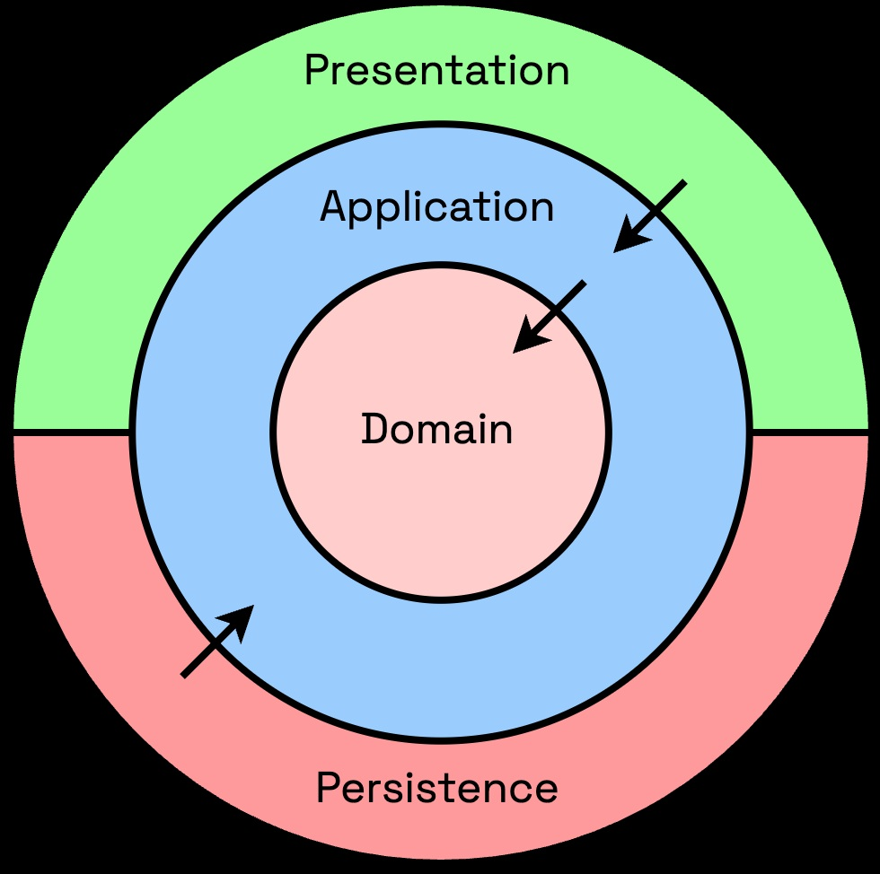

# Tätigkeitsbericht

**Dies ist ein Python-Projekt.**

Die Zeitaufschreibung erfolgt nach dem Muster **Clean Architecture**, damit Kernlogik, Oberfläche und Datenbank getrennt bleiben und einzelne Teile wiederverwendbar sind.

Das Programm soll sich die Feiertage aus einer bekannten JSON-Adresse von Google herunter laden können, 
und die entsprechende Tage damit markieren.

<p style="color:red"> Das Programm ist noch in der Entwicklungsphase</p>

## Präsentation

Überblick über Funktionen und Oberflächen des Programms (Screenshots): **[Praesentation.ppt](./Praesentation.ppt)**.

## Clean Architecture

**Clean Architecture** (Robert C. Martin) ordnet Code in **Schichten** mit **nach innen gerichteten Abhängigkeiten**: äußere Schichten dürfen innere kennen, nicht umgekehrt. So bleiben Geschäftsregeln unabhängig von UI, Datenbank oder Frameworks.

| Schicht | Rolle | In diesem Projekt (`src/`) |
|---------|--------|----------------------------|
| **Domain** | Entitäten, Validierung, fachliche Regeln ohne Technik | `Core/Domain/` (z. B. `models/entities/`, `services/`, `interfaces/`) |
| **Application** | Anwendungsfälle, Orchestrierung der Domain | `Core/Application/` |
| **Presentation** | Benutzeroberfläche, Eingaben, Anzeige | `External/Presentation/Desktop/` |
| **Persistence** | Speicherung (SQLite, Repositories) | `External/Infrastructure/` |

Die **Dependency Rule** bedeutet: Pfeile zeigen immer zur **Domain** — Presentation und Persistence hängen von Application/Domain ab, nicht umgekehrt. Konkrete Datenbank- oder Qt-Details stehen daher nicht im Kern; sie werden über **Interfaces** (Repositories) und **Dependency Injection** (`App/bootstrap.py`) eingebunden.



Die UI ist im Presentation Layer zwar im Schichtenmodell implementiert, aber nicht ganz im strengen Sinne nach Clean Architecture aufgebaut. Hierzu müsste man die UI per DI an den Application-Layer übergeben sollen, so dass alles von dort aus gesteuert wird. Vielleicht stelle ich das noch um. 


## Model

Domain-Modelle (Felder, Validierung, DTO): siehe [readme_models.md](./readme_models.md).

## Sollstunden in der Zeiterfassung

Beschreibung der Sollstunden-Berechnung (nach Vertrag und nach Stundenplan), Kommentarregeln und Tages-Flags: siehe [readme_sollstunden.md](./readme_sollstunden.md).

## Desktop-Frontend

Diese Anwendung soll eine plattformübergreifendes Desktop-Frontend ergeben, das die Zeitaufschreibung in eine SQLite-Datenbank speichert. Die Auswahl der Spalten, die nach Excel exportiert werden sollen, ist in einer zentralen Config-Datei einstellbar (config.toml). 

## Web-Frontend

Über IndexedDB wird man sich die eigenen Einträge sichern, die man mit dem Backend synchronisieren kann. 

## Backend über GraphQL

Die Kommunikation soll zu einer GraphQL-API geschehen, wenn man am Monatsende die Stunden "abgeben" will und die Abrechnung für den Monat geschehen soll. 
Dann spätestens muss man sich vorher einloggen und ein Token für die Abgabe erhalten. 

## Anbindung zur Datenbank

Die Persistenz erfolgt über SQLite. Die Anbindung geschieht über ein ORM (SQLModel auf Basis von SQLAlchemy); per Dependency Injection und Repository-Pattern bleiben die Aufrufer von der konkreten Speicherung entkoppelt. 

## Tests

Automatisierte Tests (pytest, In-Memory-SQLite, Schichten unter `test/`): siehe [test/README_tests.md](./test/README_tests.md).

## Python Setup

Empfohlen ist eine lokale virtuelle Umgebung (`venv`), damit Abhaengigkeiten isoliert sind.

### Linux (Bash)

```bash
python3 -m venv .venv
source .venv/bin/activate
python -m pip install --upgrade pip
pip install -r requirements.txt
pip install -r requirements-dev.txt
```

Zum Verlassen der Umgebung:

```bash
deactivate
```

Tests ausführen: `python -m pytest test/` — siehe [test/README_tests.md](./test/README_tests.md).

### Windows (PowerShell)

```powershell
python -m venv .venv
.\.venv\Scripts\Activate.ps1
python -m pip install --upgrade pip
pip install -r requirements.txt
pip install -r requirements-dev.txt
```

Zum Verlassen der Umgebung:

```powershell
deactivate
```

Tests ausführen (nach Aktivierung der venv): `py -m pytest test/` — Details in [test/README_tests.md](./test/README_tests.md).

### Bemerkung zum Setup

Fall zusätzliche Pakete benötigt werden, sind sie im "pip install -r requirements.txt" mit drin... 